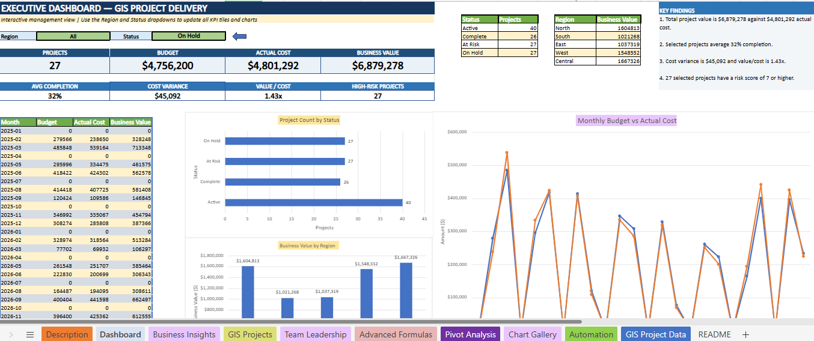

# 📊 Excel Advanced Analytics Dashboard — GIS Project Delivery

An advanced Excel dashboard project demonstrating project performance monitoring, data analysis, business insights, and reporting through Microsoft Excel.

## 📌 Project Overview

This project presents an Excel-based Executive Dashboard designed to monitor GIS project delivery, project budgets, actual costs, business value, project status, and completion progress.

The workbook combines structured project data, analytical formulas, PivotTables, charts, and dashboard reporting to transform raw project information into meaningful insights.

The project also explores how Excel analytics can support GIS project management, utility data management, and operational reporting.

## 🎯 Project Objectives

- Monitor project delivery and completion progress.
- Compare project budgets with actual costs.
- Analyze business value and cost variance.
- Track projects by status and region.
- Present key performance indicators through a dashboard.
- Explore Excel-based reporting and automation techniques.

## 🛠️ Tools & Technologies

- Microsoft Excel
- Advanced Excel Formulas
- PivotTables and Pivot Analysis
- Data Visualization
- Dashboard Design
- Conditional Formatting
- Project Data Analysis
- Reporting and KPI Monitoring

## 📈 Key Dashboard Features

### 1. Executive Dashboard
- Total project count
- Total budget and actual cost
- Business value overview
- Average project completion
- Cost variance and value-to-cost ratio
- Project status overview

### 2. Business Insights
- Project performance analysis
- Business value by region
- Cost and budget comparisons
- Summary of key findings

### 3. GIS Project Management
- GIS project data organization
- Project status monitoring
- Regional project analysis
- Project completion tracking

### 4. Pivot Analysis & Charts
- Project count by status
- Monthly budget versus actual cost
- Business value comparisons
- Visual reporting of project metrics

### 5. Advanced Excel Practice
Dedicated worksheets for exploring advanced formulas, charting, pivot analysis, and automation-related techniques.

## 🖼️ Project Preview

The repository's `Screenshot` folder contains visual previews of the Excel dashboard and workbook.
###Executive Dashboard


## 🌍 Relevance to GIS

As a GIS Technician, I recognize that geospatial work involves more than mapping. Data quality, project tracking, analysis, and reporting are also important.

Excel can complement GIS workflows by helping with:

- Attribute table validation and data cleaning
- Utility asset data summaries
- Project progress reporting
- Identification of missing or duplicate records
- Analysis of GIS production metrics
- Preparation of structured reports

This project demonstrates my interest in combining GIS knowledge with data analysis and reporting skills.

## 📂 Repository Structure

```text
excel-advanced-analytics-dashboard/
├── Assets/
├── Documentation/
├── Screenshot/
├── Workbook/
└── README.md
```

## 🚀 Future Improvements

- Expand dashboard interactivity.
- Add more automated data validation checks.
- Explore Power Query for data transformation.
- Explore Python-based data processing.
- Investigate integration with GIS datasets and reporting workflows.

## 👨‍💻 About Me

**Naman Kumar**  
GIS Technician | Excel Analytics | GIS Data Management

I am continuously developing my skills in GIS, data analysis, visualization, and automation to build efficient data-driven workflows.

## ⭐ Project Goal

To demonstrate practical Excel analytics skills and explore how data-driven reporting can complement GIS project delivery.
